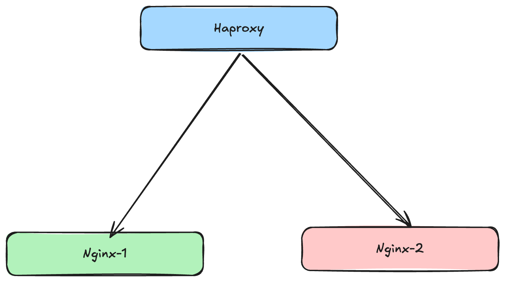

### A trival setup that illustrates how to use Haproxy

In our case we can imagine that we have two instances of a nginx servers and we wish to have a singe entrypoint to both applications hosted by each instance. 

You can take a look at the configuration defined in the `haproxy` directory, the part that does the path-based routing : 

````
frontend http_front
    # listening on
    bind *:80
    # based on the path either we route the the 1st or the 2nd instance
    use_backend http_nginx_1 if { path_beg -i /nginx-1 }
    use_backend http_nginx_2 if { path_beg -i /nginx-2 }
    default_backend http_nginx_1

backend http_nginx_1
    mode http
    # we rewrite the url to from /nginx-n/<whatever> --> /<whatever>
    http-request set-path '%[path,regsub("^/nginx-1/?(.*)","/\1",g)]'
    server nginx_server nginx-1c:80

backend http_nginx_2
    mode http
    http-request set-path '%[path,regsub("^/nginx-2/?(.*)","/\1",g)]'
    server nginx_server nginx-2c:80 
````

There's also the `Dockerfile` responsible for the nginx instances. 

Here's a graphical representation: 




To try the setup:
```
- docker network create webnet
- docker build --build-arg DIR_TO_COPY_FROM=./nginx-1 -t nginx-1 .
- docker build --build-arg DIR_TO_COPY_FROM=./nginx-2 -t nginx-2 . 
- cd ./haproxy
- docker build -t haproyx-rev  . 
- docker run --name nginx-1c --network webnet -d -p <port>:80 nginx-1
- docker run --name nginx-2c --network webnet -d -p <port>:80 nginx-2
- docker run --name haproxy --network webnet -d -p <port>:80 haproyx-rev
```